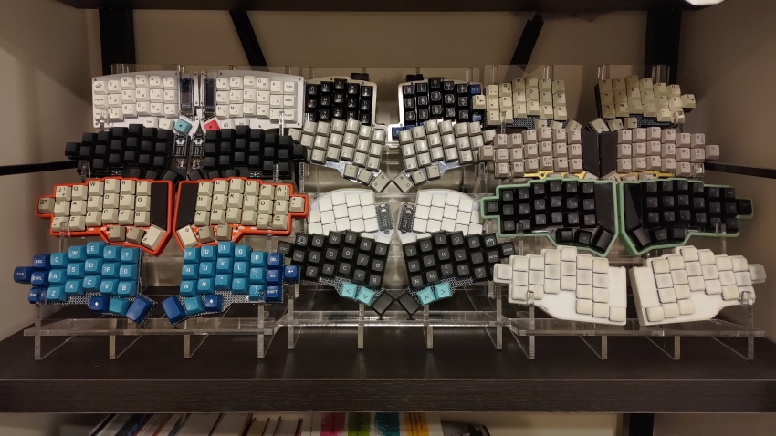

# Stands for split keyboards

Stands for split keyboards made for laser-cutting 6 mm. acryllic.

The cutouts for inserting other acryllic plates are 5.8 mm. to account for laser-cutting tolerances.
These designs were tested with two different laser-cutting services, but you may want to adjust them for your specific cutter.

Two, three and four-layer stands are available.
The stands fit everything from a Sweep to a Jianovka.

The original design was made in CorelDraw, laser-cutting designs are available in SVG and DXF.

Parts needed for a single stand:
- Two split_stand_outer_n_layer outer plates (with "fangs" to hold up the side of your split), 
- Two split_stand_inner_n_layer inner plates (with a flat middle to place the thumb cluster),
- Two + n (number of layers) split_stand_plate horizontal plates for stability and shelves.

Tip: it's usually better to insert the top and bottom plates first, then the "layer" shelves.
